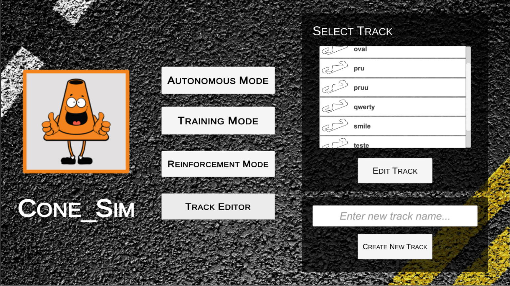

### Cone-SIM

A simple self-driving car simulator built with Unity.

  - Easy to create new tracks
  - Save training data in txt files
  - Udp interface with autonomous mode

### Precompiled builds

V0 - 1/19/18
  - [Linux](https://drive.google.com/open?id=1H92uKw3k1OTCE58SPFoQ247ly4FyhGGC)
  - [Windows](https://drive.google.com/open?id=13OlOGZzfnkzZZPYdxJ5oKztiSti_O4Sq)

### Training Mode

### Track Editor

### To-do List
  - Improve joystick and racing wheel interface
  - Reinforcement Mode

Some bugs may apper!

