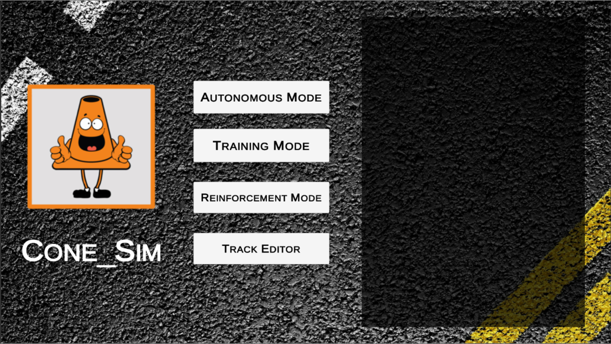
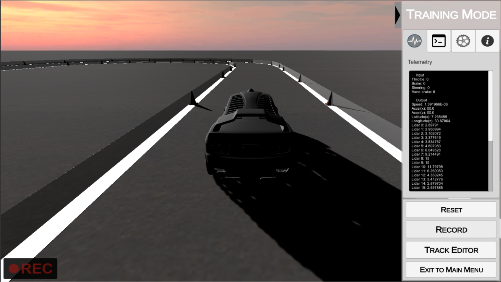
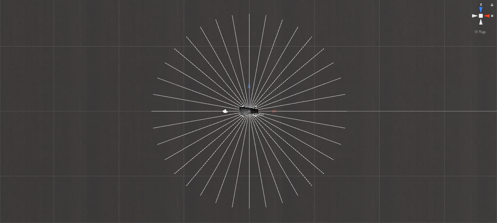
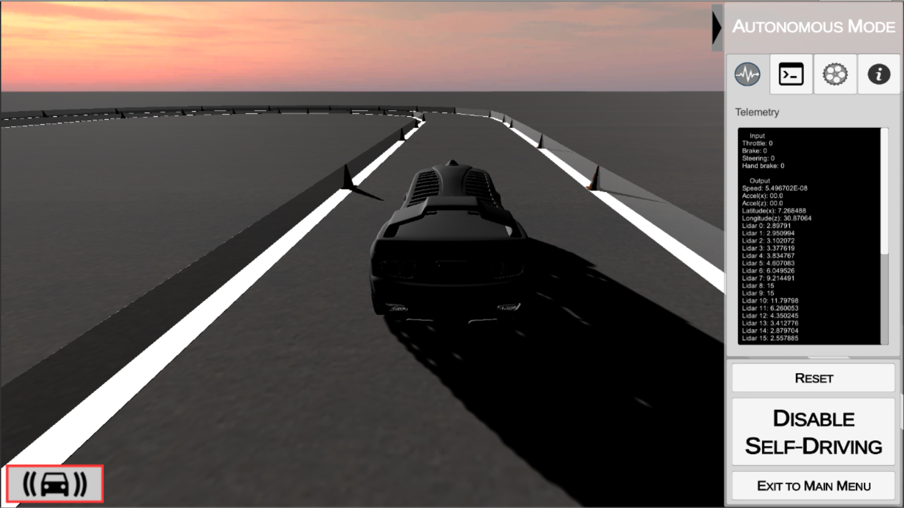
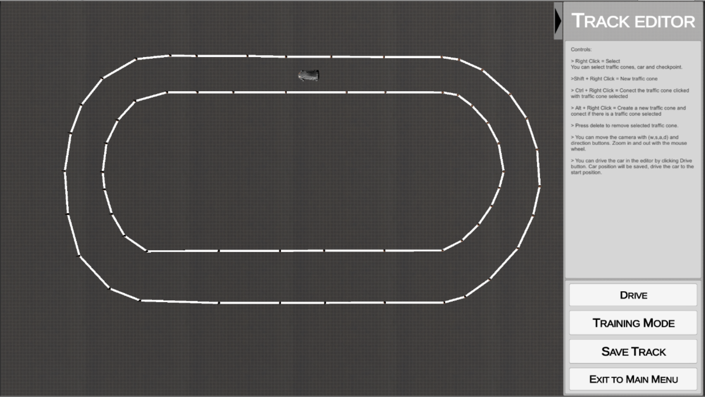

### Cone-SIM
A simple self-driving car simulator built with Unity.

The fist version of this game is being developed to train neural networks using supervised learning.

  - Easy to create new tracks
  - Save training data in txt files
  - Udp interface with autonomous mode

<p align="center">

</p>

## Precompiled builds

V0 - 1/19/18
  - [Linux](https://drive.google.com/open?id=1H92uKw3k1OTCE58SPFoQ247ly4FyhGGC) (109,7 MB)
  ```
 Download
 Extract the contents of Linux_x86_universal.zip
 
 Inside Linux_x86_universal/Linux_x86_universal folder
 Right click on Cone_SIM.x86 or Cone_SIM.x86_64
 Properties-> Permission-> Check "Allow executing file as program"
 Double click on Cone_SIM.x86 or Cone_SIM.x86_64
 
 Or in terminal
 $ cd Linux_x64_universal/Linux_x64_universal
 $ chmod +x Cone_SIM.x86          # 32-bit
 $ chmod +x Cone_SIM.x86_64       # 64-bit
 $ ./Cone_SIM.x86                 # 32-bit
 $ ./Cone_SIM.x86_64              # 64-bit
 
 Unity configuration window will be open, where is possible to configure graphics and input settings.
 Click Ok to start the game.
  ```
  
  - [Windows 64-bit](https://drive.google.com/open?id=13OlOGZzfnkzZZPYdxJ5oKztiSti_O4Sq) (62,0 MB)
  ```
  Download
  Extract the contents of Windows_64b.zip
    
  Inside Windows_64b/Windows_64b folder
  Double click on Cone_SIM.exe
    
  Unity configuration window will be open, where is possible to configure graphics and input settings.
  Click Ok to start the game.
  
  ```
  
## Training Mode

<p align="center">

</p>

In Table 1. is shown the data that is store which frame

Table 1

| Index | Data |
| ------ | ------ |
| 0 | Recording time |
| 1 | Throttle input |
| 2 | Brake input |
| 3 | Steering input |
| 4 | Handbrake input |
| 5 | Car speed |
| 6 | Acceleration x |
| 7 | Acceleration z |
| 8 | Position x |
| 9 | Position z |
|10 to 45 | 36 raycasts distance |

P.S.:
  - From the image below z is the vertical axis, and x is the horizontal axis
  - Raycast[0] is in the right side (90º) of the car

<p align="center">

</p>

## Autonomous Mode

<p align="center">

</p>

Which frame a string is send throgh udp. This string contais the same data shown in Table 1.
The game waits for a csv string with the data shown in Table 2.

Table 2

| Index | Data |
| ------ | ------ |
| 0 | Throttle |
| 1 | Brake |
| 2 | Steering |
| 3 | Handbrake |

## Track Editor

<p align="center">

</p>

## To-do List
There is many things to be done
  - Improve joystick and racing wheel interface
  - Reinforcement Mode


Some bugs may apper!

